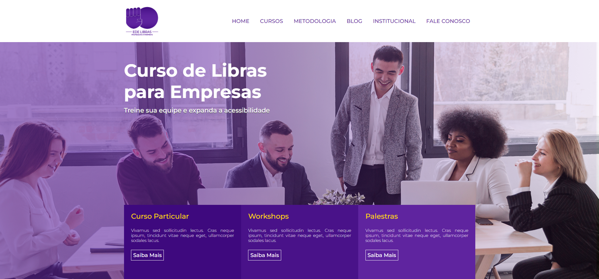

<h1 align="center">Brazilian Sign Language Course - Website<h1>

#

  > <h2 align="center">This project was my first HTML and CSS front-end development,  I create all the Visual Identity and code the front-page</h2>

## 📃 Description
  
All the project was development during the *{Parças} Developers School®* course, following the teacher's explanation Bonieky.

## 🖥 Link to access the site 
https://edelibras.netlify.app/

Copyright © 2022 nathanparente

